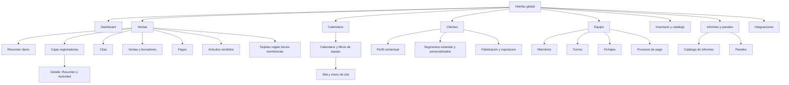

# Mapa de arquitectura de información observado

```mermaid
flowchart TD
 A[Interfaz global] --> B[Dashboard]
 A --> C[Ventas]
 A --> D[Calendario]
 A --> E[Clientes]
 A --> F[Equipo]
 A --> G[Inventario y catalogo]
 A --> H[Informes y paneles]
 A --> I[Integraciones]
 C --> C1[Resumen diario]
 C --> C2[Cajas registradoras]
 C --> C3[Citas]
 C --> C4[Ventas y borradores]
 C --> C5[Pagos]
 C --> C6[Articulos vendidos]
 C --> C7[Tarjetas regalo bonos membresias]
 C2 --> C8[Detalle: Resumen y Actividad]
 D --> D1[Calendario y filtros de equipo]
 D1 --> D2[Alta y menu de cita]
 E --> E1[Perfil contextual]
 E --> E2[Segmentos estandar y personalizados]
 E --> E3[Fidelizacion y reputacion]
 F --> F1[Miembros]
 F --> F2[Turnos]
 F --> F3[Fichajes]
 F --> F4[Procesos de pago]
 H --> H1[Catalogo de informes]
 H --> H2[Paneles]
```

Este es un mapa de secciones visibles en la investigación, no un inventario total garantizado de Fresha.
